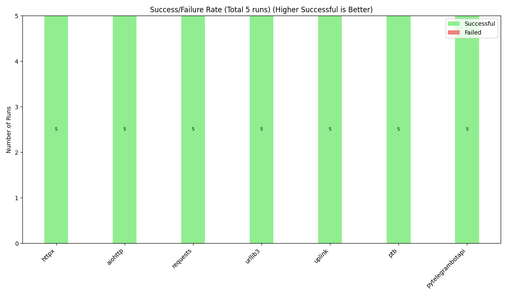
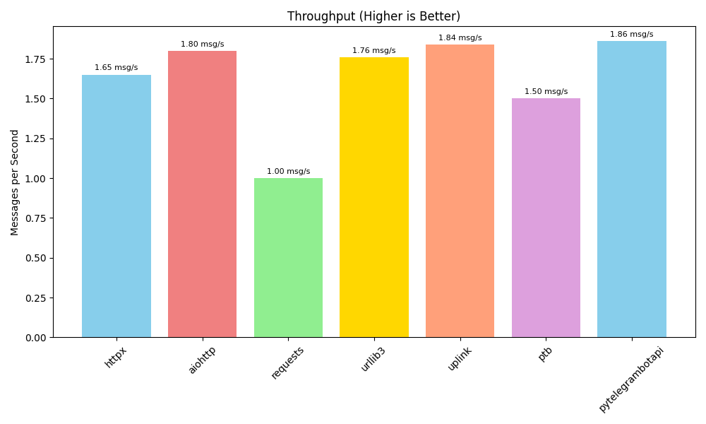
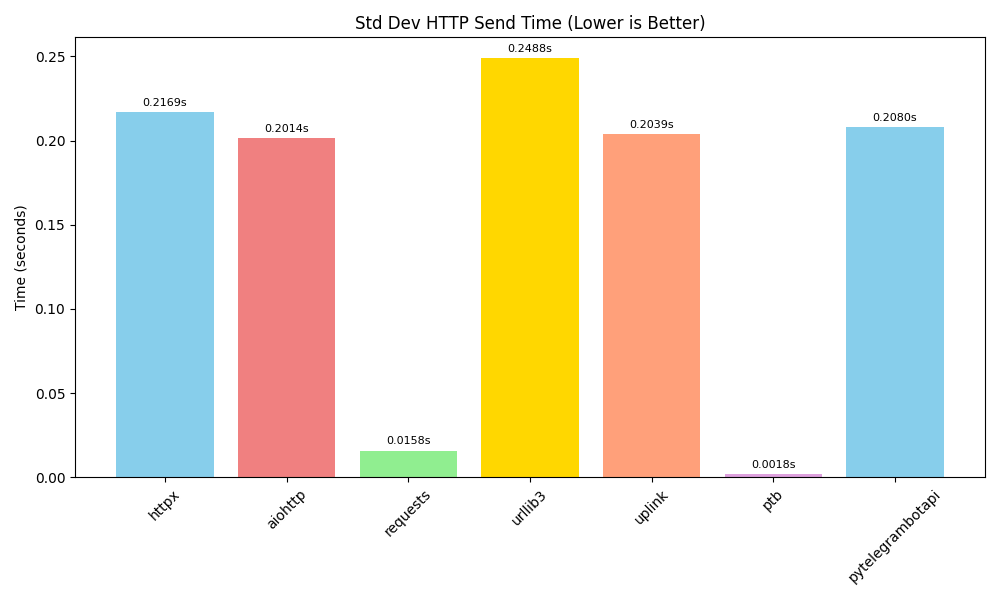
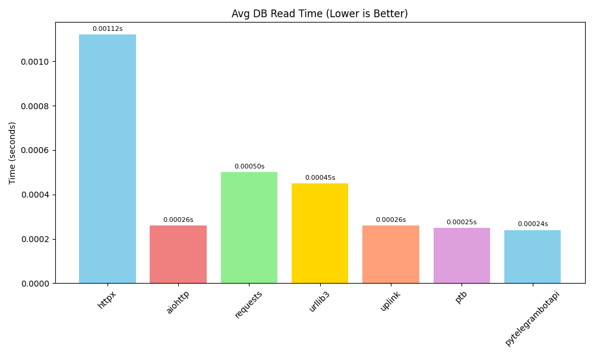
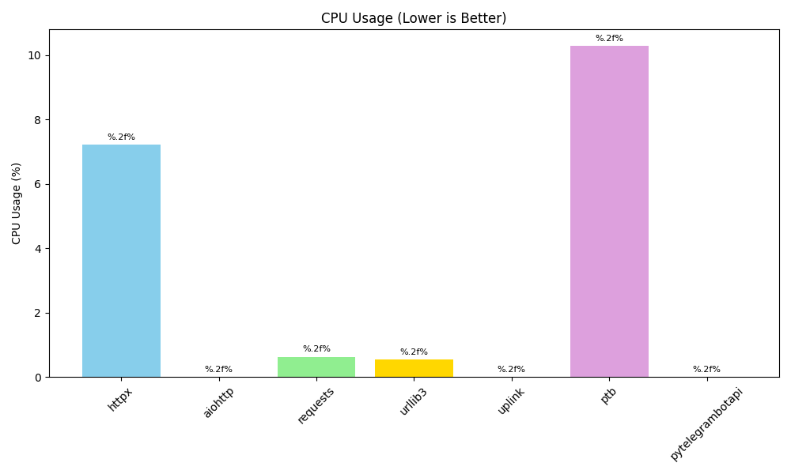
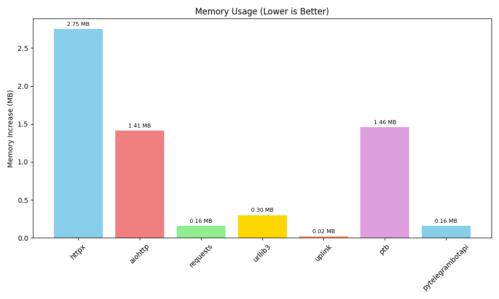

# Telegram HTTP Library Benchmark
## Overview
- **Date:** 2025-05-09 04:16:58 (Sydney UTC+10)
- **Number of Messages per Library:** 10
- **Libraries Tested:** httpx, aiohttp, requests, urllib3, uplink, ptb, pytelegrambotapi
- **Python Version:** 3.13.2
- **Platform:** Windows-11-10.0.26100-SP0
- **GitHub Project:** [telegram_api_benchmark](https://github.com/furkancybercore/telegram_api_benchmark)

---

## Test Methodology
This benchmark test was conducted using the following steps:
- We created a PostgreSQL database to store test messages
- For each HTTP library, we:
  - Read messages from the database
  - Sent these messages to the Telegram API
  - Measured performance and resource usage
- Due to Telegram's message limit (20 messages per minute), we sent messages to a personal Telegram account instead of a channel
- This allowed us to run 1000 tests for each method
- We compared different Python HTTP libraries including requests, httpx, aiohttp, urllib3, etc.
- Each test measures success rate, speed, and computer resource usage

---

## Summary of Best Performers
**Performance Metrics:**
- **Success Rate:** 100.00% (httpx, aiohttp, requests, urllib3, uplink, python-telegram-bot, pytelegrambotapi)
- **Total Processing Time:** 0.4504s (python-telegram-bot)
- **Throughput:** 2.05 msg/s (pytelegrambotapi)
- **HTTP Send Time:** 0.0000s (N/A)
- **DB Read Time:** 0.00000s (N/A)
- **Consistency (Lowest Std Dev):** 0.0107s (requests)
- **Response Size:** 0.0 bytes (N/A)
 
**Resource Usage Metrics:**
- **CPU Usage:** 0.29% (uplink)
- **Memory Usage:** 0.03 MB (uplink)

---

## All Metrics Comparison
The table below compares all libraries across the key metrics:

| Library | Success Rate (%) | Throughput (msg/s) | Avg Total Time (s) | Std Dev Total (s) | CPU Usage (%) | Memory (MB) | Avg HTTP Time (s) | Avg DB Read (s) | Avg Response Size (B) |
| --- | --- | --- | --- | --- | --- | --- | --- | --- | --- |
| httpx | 100.00 | 1.90 | 0.5047 | 0.1658 | 4.75 | 2.95 | 0.5043 | 0.00041 | 253.1 |
| aiohttp | 100.00 | 1.94 | 0.5155 | 0.1603 | 0.30 | 1.46 | 0.5152 | 0.00025 | 255.1 |
| requests | 100.00 | 1.03 | 0.9585 | 0.0107 | 0.48 | 0.13 | 0.9582 | 0.00035 | 256.1 |
| urllib3 | 100.00 | 1.97 | 0.5045 | 0.1602 | 0.31 | 0.15 | 0.5041 | 0.00036 | 255.1 |
| uplink | 100.00 | 1.85 | 0.5391 | 0.2074 | 0.29 | 0.03 | 0.5389 | 0.00024 | 254.1 |
| python-telegram-bot | 100.00 | 1.78 | 0.4504 | 0.0281 | 6.68 | 1.43 | 0.4502 | 0.00024 | 373.1 |
| pytelegrambotapi | 100.00 | 2.05 | 0.4881 | 0.1508 | 0.32 | 0.28 | 0.4878 | 0.00025 | 264.1 |

---

## Performance

#### Success Rate
> _Number of attempts (DB read + Telegram send) that completed successfully. Higher is better._

#### Throughput
> _Messages processed per second. Higher indicates better efficiency._

#### Total Processing Time
> _Average time per message (DB read + Telegram send). Lower is better._

#### Processing Time Consistency
> _Standard deviation of total processing time. Lower indicates more predictable performance._

#### HTTP Send Time
> _Average time for the Telegram API request only. Lower is better._

#### HTTP Time Consistency
> _Standard deviation of HTTP send time. Lower indicates less network variation._

#### DB Read Time
> _Average time to read from PostgreSQL. Lower is better._

#### Response Size
> _Average size of the response from Telegram API. Smaller indicates less overhead._

## Resource Usage

#### CPU Usage
> _Average CPU percentage used by the Python process during the benchmark. Lower is better._

#### Memory Usage
> _Increase in Python process RAM from start to end of the benchmark. Lower is better._

---

## Conclusion
- This benchmark shows how different Python libraries work when sending messages to Telegram
- The metrics focus on;
 -- resource utilization
 -- success rates
 -- throughput
 -- processing times
 -- consistency
- We should choose the library that matches our project's specific needs