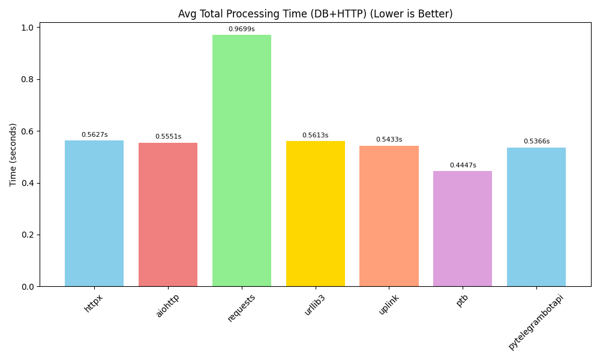
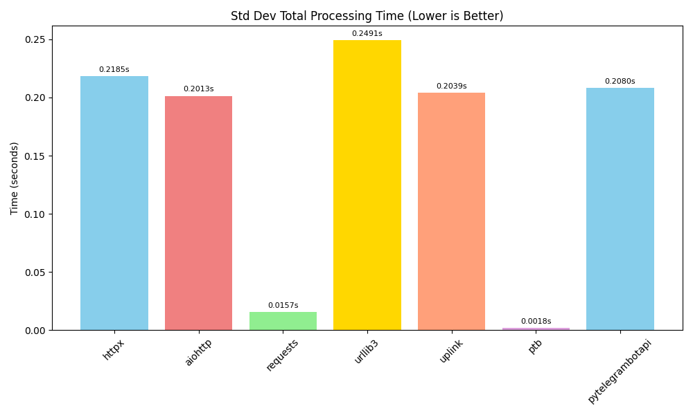

# Telegram HTTP Library Benchmark
## Overview
- **Date:** 2025-05-08 17:00:21
- **Number of Messages per Library:** 2
- **Libraries Tested:** httpx, aiohttp, requests, urllib3, uplink, ptb, pytelegrambotapi
- **Python Version:** 3.13.2
- **Platform:** Windows-11-10.0.26100-SP0

---

## Summary of Best Performers
- **Fastest Avg. Total Processing Time (DB+HTTP):** pytelegrambotapi (0.6989s)
- **Highest Throughput:** pytelegrambotapi (1.43 msg/s)
- **Most Consistent (Lowest Std Dev - Total Time):** uplink (0.2414s)
- **Highest Success Rate:** httpx (100.00%)
- **Lowest Memory Usage:** uplink (0.04 MB)
- **Lowest CPU Usage:** uplink (0.00%)

---

## Performance Rankings & Visualizations

### Total Processing Time (DB+HTTP)
> _Average time per message (DB read + Telegram send). Lower is better._

### Throughput
> _Messages processed per second. Higher indicates better efficiency._

### Total Processing Time Consistency (Std Dev)
> _Standard deviation of total processing time. Lower indicates more predictable performance._

### HTTP Send Time
> _Average time for the Telegram API request only. Lower is better._

### HTTP Send Time Consistency (Std Dev)
> _Standard deviation of HTTP send time. Lower indicates less network variation._

### DB Read Time
> _Average time to read from PostgreSQL. Lower is better._

### Success Rate
> _Percentage of attempts (DB read + Telegram send) that completed successfully. Higher is better._

### Telegram API Response Size
> _Average size of the response from Telegram API. Smaller indicates less overhead._

## Resource Usage (Lower is Better)

### Memory Usage
> _Increase in Python process RAM from start to end of the benchmark. Lower is better._

### CPU Usage
> _Average CPU percentage used by the Python process during the benchmark. Lower is better._

---

## Conclusion
This benchmark measures the performance of different Python HTTP client libraries for sending messages to the Telegram API. The metrics focus on database read time, Telegram message send time, total processing time, throughput, success rates, latency consistency (standard deviation), and resource utilization.