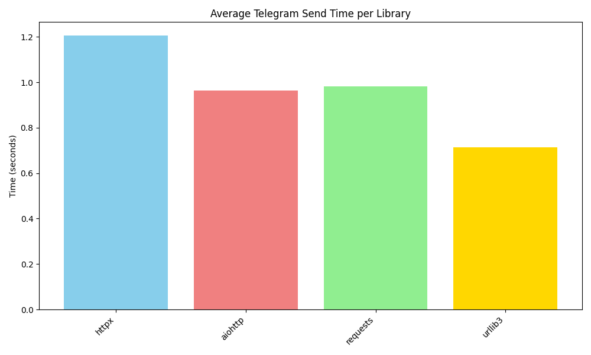
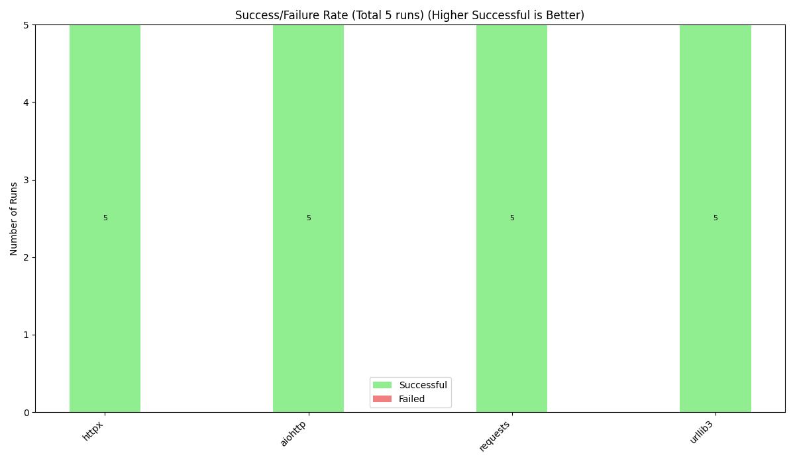
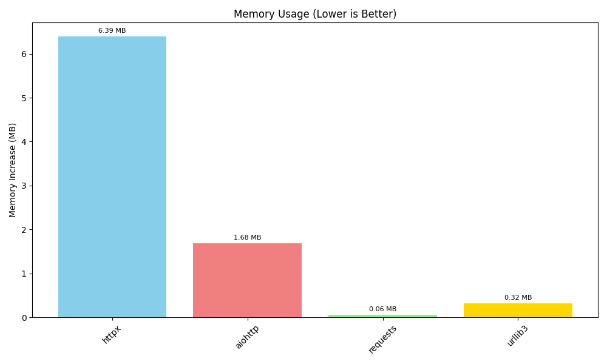
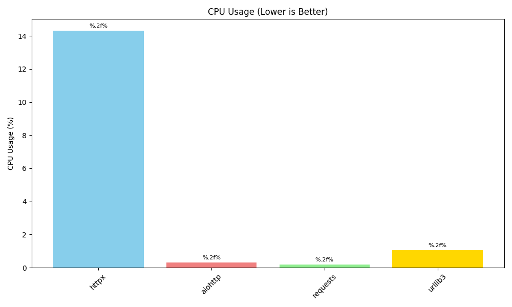

# Telegram HTTP Library Benchmark
## Overview
- **Date:** 2025-05-08 14:34:20
- **Number of Messages per Library:** 5
- **Libraries Tested:** httpx, aiohttp, requests, urllib3
- **Python Version:** 3.13.2
- **Platform:** Windows-11-10.0.26100-SP0

---

## Summary of Best Performers
- **Fastest Avg. Telegram Send Time:** aiohttp (0.9607s)
- **Highest Success Rate:** httpx (100.00%)
- **Lowest Memory Usage (Workflow):** requests (0.08 MB)
- **Lowest CPU Usage (Workflow):** requests (0.00%)

---

## Detailed Results per Library
| Library | Version | Avg TG Send (s) (Lower is Better) | Min TG Send (s) (Lower is Better) | Max TG Send (s) (Lower is Better) | Total Runs | Success Runs (Higher is Better) | Failed Runs (Lower is Better) | Success Rate (%) (Higher is Better) | CPU (%) (Lower is Better) | Memory (MB) (Lower is Better) |
|---------|---------|-----------------------------------|-----------------------------------|-----------------------------------|------------|-------------------------------|-----------------------------|-----------------------------------|---------------------------|-----------------------------|
| httpx | 0.27.0 | 1.1635 | 1.1350 | 1.2428 | 5 | 5 | 0 | 100.00 | 14.28 | 7.16 |
| aiohttp | 3.9.5 | 0.9607 | 0.9511 | 0.9699 | 5 | 5 | 0 | 100.00 | 0.29 | 1.23 |
| requests | 2.32.3 | 1.0004 | 0.9687 | 1.0379 | 5 | 5 | 0 | 100.00 | 0.00 | 0.08 |
| urllib3 | 2.2.2 | 1.1890 | 0.4366 | 3.6117 | 5 | 5 | 0 | 100.00 | 0.48 | 0.33 |

---

## Performance Rankings & Visualizations

### Fastest Average Telegram Send Time (Lower is Better)

| Rank | Library | Avg Time (s) |
|------|---------|--------------|
| 1 | aiohttp | 0.9607 |
| 2 | requests | 1.0004 |
| 3 | httpx | 1.1635 |
| 4 | urllib3 | 1.1890 |

### Highest Success Rate (Higher is Better)

| Rank | Library | Success Rate (%) |
|------|---------|------------------|
| 1 | httpx | 100.00 |
| 2 | aiohttp | 100.00 |
| 3 | requests | 100.00 |
| 4 | urllib3 | 100.00 |

## Resource Usage Rankings (Lower is Better)

### Lowest Memory Usage (Workflow) (Lower is Better)

| Rank | Library | Memory Increase (MB) |
|------|---------|----------------------|
| 1 | requests | 0.08 |
| 2 | urllib3 | 0.33 |
| 3 | aiohttp | 1.23 |
| 4 | httpx | 7.16 |

### Lowest CPU Usage (Workflow) (Lower is Better)

| Rank | Library | CPU Usage (%) |
|------|---------|---------------|
| 1 | requests | 0.00 |
| 2 | aiohttp | 0.29 |
| 3 | urllib3 | 0.48 |
| 4 | httpx | 14.28 |

---

## Conclusion
This benchmark measures the performance of different Python HTTP client libraries for sending messages to the Telegram API. The metrics focus on the Telegram message send time, success rates, and resource utilization.